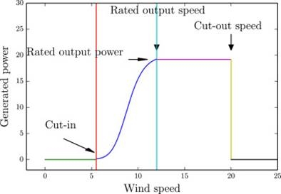

# Results Presentation

## Glossary :

1. Wind Turbines : Basics
2. Data Exploration
3. Data Reconciliation - Frequencies and Time Stamps
4. Feature Engineering - Aggregations
5. Data Correlations
6. Model Benchmark
7. Model Insights
8. Model selection : what/who for ? 
9. Towards deployment
10. Towards continuous integration

## 1. Wind Turbines Production - Basics

- Wind turbine power curves : power depends on speed regimes

- if speed > nominal_speed, power = nominal_power
- if speed > max_speed, wind turbine stops

    

- Depends on wind orientation/direction

    

- Depends on pressure (impacts the density of air going through)
- Depends on temperature : in case of frost, wind turbines stop

## 2.1: Data Exploration - Installed Capacity

Selected Data : 

```
 #   Column                      Non-Null Count  Dtype  
---  ------                      --------------  -----  
 0   Année                       247 non-null    int64  
 1   Code INSEE région           247 non-null    int64  
 2   Région                      247 non-null    object 
 3   Parc installé éolien (MW)   223 non-null    float64
 4   Parc installé solaire (MW)  178 non-null    float64
 5   Géo-shape région            247 non-null    object 
 6   Géo-point région            247 non-null    object 
```

- **Hypothesis :** What to do with nans 
→ First values : probably no installed capacity because they are empty on the website too
→ For the others : fillna bfill ? → probably no need since I interpolate it later

    

- **Insight :**  Grand Est and Hauts-de-France will be key for global production, as shown on the graph below :


- **Hypothesis :** I could try to predict not the output directly but the **output/capacity then multiply** by actual french capacity
- **Hypothesis :** Granularity of one year. Usually I adapt all data to work at the biggest granularity
In this case it would not work, so I could interpolate the values at whatever granularity I pick for the other data sources.
- Capacity : interpolated values for all regions and indexed with YEAR START :

    

## 2.2: Data Exploration - Production

Selected Data : 

```
 #   Column             Non-Null Count    Dtype  
---  ------             --------------    -----  
 0   Code INSEE région  1594944 non-null  int64  
 1   Région             1594944 non-null  object 
 2   Nature             1594944 non-null  object 
 3   Date               1594944 non-null  object 
 4   Heure              1594944 non-null  object 
 5   Date - Heure       1594944 non-null  object 
 6   Consommation (MW)  1594932 non-null  float64
 7   Eolien (MW)        1594836 non-null  float64
 8   TCO Eolien (%)     122688 non-null   float64
 9   TCH Eolien (%)     122112 non-null   float64
```

- **Insight :** Data is average power produced over 30 minutes (MW), not total energy produced (MWh)
- Granularity : 30 minutes
- TCO Eolien (%) -> Taux de couverture de la production éolienne
TCH Eolien (%) -> Taux de charge de la production éolienne
- TCH had some string values → replaced them and converted to float


## Weather

Selected Data : 

```
 #   Column                               Dtype  
---  ------                               -----  
 0   ID OMM station                       int64  
 1   Date                                 object 
 2   Pression au niveau mer               float64
 3   Variation de pression en 3 heures    float64
 4   Direction du vent moyen 10 mn        float64
 5   Vitesse du vent moyen 10 mn          float64
 6   Température                          float64
 7   Pression station                     float64
 8   Niveau barométrique                  float64
 9   Variation de pression en 24 heures   float64
 10  Température du thermomètre mouillé   float64
 11  Rafale sur les 10 dernières minutes  float64
 12  Rafales sur une période              float64
 13  Periode de mesure de la rafale       float64
 14  Altitude                             int64  
 15  region (name)                        object 
 16  region (code)                        float64
 17  mois_de_l_annee                      int64  
```

- Granularity : 3h. Will serve as base granularity from now on.
- Wind speed distribution is very skewed towards small values

    

    - WindRose doc : `Fitting Weibull distribution is enabled by Scipy. The Weibull distribution is used in weather forecasting and the wind power industry to describe wind speed distributions, as the natural distribution of wind speeds often matches the Weibull shape`
- Wind Direction Distribution


- How to aggregate the Weather ?  :
    - Globally (all regions) : `groupby("Date").mean()` →

        

    - First removing data where wind speed == 0 :

        

    - Or providing an aggregation for each regions :

    

    ## 3. Data Merge :

    - **Hypothesis :** (more a trick) → moved first time stamp of the installed capacity to 1 AM to match the production and weather data timestamps
    - **Hypothesis :** resampled production data to 3h (instead of 30 minutes) with sum
    The other possibility was to interpolate weather data down to 30 minutes to match production data, but it won't be explored here.
    - Here the production has been resampled to (aggregated by sum) 3h and the capacity interpolated. 
    Because we summed the production, it corresponds now to MWh instead of MW

        

    - Relative production (for 3h periods), probably the our model target :

    

    - **Hypothesis :** to get back to equivalent MW, we can divide by 6. The relative power will now be between 0 and 1
    - **Hypothesis :** data can be truncated before "2013-01-01 00:00:00+1" :  `truncate(before="2013-01-01 00:00:00+1")`
    It's the first timestamp with all data sources

    ## 4. Feature Engineering - Aggregations

    - For the weather data :
        - average wind speed and direction - national
        - average pressure, temperature - national
        - average wind speed and direction - per region
        - I tried grouped the wind direction into 30° slots, but it did not provide any modeling value
    - Could be tried :
        - Average temperature and pressure per region
        - average wind speed and direction - per commune

    ## 5. Correlations

    - Wind speed and relative production :

    

    **Insight :** There is a relative correlation between average national speed (lot of aggregation) and relative production

    - Wind direction and relative production :

    

    

    **Insight :** The correlation with wind direction is not visible

    - Wind speed and direction for Hauts-de-France (top 2 installed capacity)

    

    

    **Insight :** The correlations are similar to national data

    - Wind speed and direction for Grand Est (top 2 installed capacity)

    

    **Insight :** The correlations are similar to national data

    - Relative production as a function of National Wind speed, but with color being Wind Speed for Grand Est

    

    **Insight :** National and regional speed seem to bring complementary information

- **Correlation Matrix (heat map) :**


## 6. Model Benchmark

- Models tested :

    $LinearRegression(normalize=True),

    LassoCV(normalize=True),

    RandomForestRegressor(),

    AdaBoostRegressor(),

    LarsCV(normalize=True),

    ExtraTreesRegressor(),

    GradientBoostingRegressor()$

- Scenarii :
    1. Relative production as target → production and capacity excluded from features
    2. Production as target → capacity kept in features
- Features used :
    - all present after pre-processing except detailed above
    - also tested reducing with RF feature importance
    - also tried keeping only national averages (poor results)
- Train/Test splits used :
    - 75% / 25% → `Train before 2018-09-11 08:00:00+02:00 and test after.`→ gives best result and doesn't seem to result in more over fitting (see below)
    - 50% / 50%→ `Train before 2016-10-18 05:00:00+02:00 and test after.`
- Results (cropped) sorted by best R² on test data :


- Watching out for Over-fitting :


- Impact of estimator type :


- Model selected `n° 15`:
    - Shortlist of features, only the most important
    - As much data as seemed necessary for good results : 50% train
    - Equation : (terms equal to zero are non null but smaller than the display limit)
    `+0.025*speed_44 +0.023*speed_28 +0.017*speed_24 
    +0.012*speed_32 +0.012*speed_53 +0.011*speed_76 +0.008*speed_75 
    +0.001*speed_11 +0.0*gust +0.0*pressure -0.0*direction_94 
    -0.008*temperature -0.009*speed_94 -0.017*speed +1.401`

    

    - This model is very similar to the output (saved in models folder) of the `main.py` script
    - The script uses a model training function that can be used with any `scikit-learn` estimators, any train/test split and any `**kwargs`

## 7. Model insights :

- Linear models fare pretty well over more complicated models
- CVRMSE is high (`Coefficient of Variation of Root-Mean Squared Error`)
Used for energy models measure and validation
- *As per ASHRAE Guideline 14, a CV(RMSE) of and below 25% indicates a good model fit with acceptable predictive capabilities*


- **speed_28** has a lot of predicting power, which is surprising considering the small capacity installed there (**Normandie**)

    

- `direction_grouped` for each regions : dropped because useless
- It was indeed better to use the relative power as target (it really shows in the test period ) :


## 8. Model selection : what/who for ?

- Model selection : I should know what the model is used for, and by whom
    - Is the model used once to estimate savings or a potential upgrade ?
    - Is the model deployed and serviced with new data regularly ?
    - Can the model be a black box ?
        - If yes, it can then be "explained" with PDP plots and shapley values (not done here)
    - Who will use and validate the model ?

**Hypothesis :** Without knowing more, and considering a simple white-box model to be superior with similar scores :
→ I would pick and deploy the linear regression, because it fares well and is easy to explain to a potential client/user

## 9. Towards deployment

- All the pre-processing and reconciliation of the big files has been coded into a script: `one line of code necessary to run`
- The actual feature engineering was included as well, but it could be upgraded !
- Deployment : easy because of the packaged preprocessing, but the files should be replaced with only the new data coming in for each prediction (otherwise it's too long)
- The model would need to be fed the processed data to output predictions with, and then the predictions would likely be made available on a database or a website ?
- The installed capacity curve could be extrapolated or forecast for better availability

- Additional data : detail on wind turbine models, count, and position
 **so that weather data and altitudes can be weighted with installed power**
- predictions de modèles pour les régions les plus productrices utilisés comme features d'un modèle global ? 
Permettrait d'utiliser les vitesse de vent par commune

## 10. Towards continuous integration

- Improve on the existing functions
- A data downloading function could be useful if the data needs to be updated often (and manage only new data coming in)
- pre_processing script could only take NEW data in (because of the file sizes)
- Add continuous integration on github
- Unit and integration tests
- If necessary, could be made into a library for wind power modeling and made available on `pypi`

# That's all for now, Thanks for reading !

